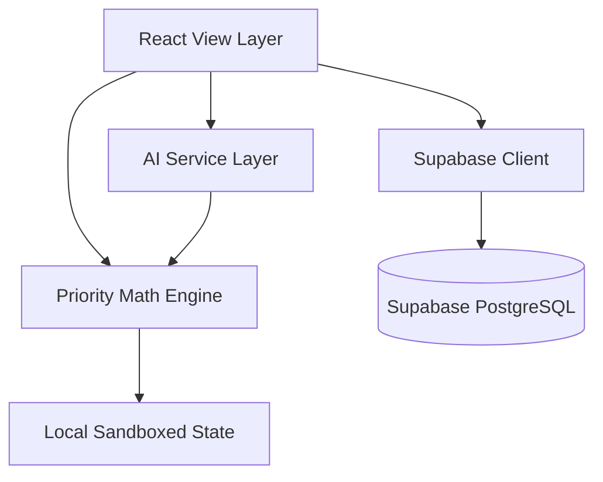

# Nudge: Technical Architecture

This document describes the architectural patterns, component hierarchy, and computational math formulas powering the Nudge AI-powered productivity companion.

---

## 1. System Topology Overview

Nudge is designed as a secure, frontend-first React 19 web application built on Vite and TypeScript, featuring a hybrid local sandbox state and remote cloud sync layer with Supabase.

### Routing & Session Lifecycle
- **Router**: Embedded custom history-synchronized path router with HTML5 pushState support in `src/App.tsx`.
- **Hybrid Local Fallback**: When Supabase credentials are not detected (`isSupabaseConfigured = false`), the application seamlessly starts a zero-dependency sandboxed mock mode to enable offline evaluation.

---

## 2. Core Computational Engines

### A. The Priority Math Engine (`src/utils/priorityEngine.ts`)
Tasks are sorted and arranged using a multi-factor linear priority score calculation rather than simple chronological order:

$$\text{Score} = \text{Deadline Proximity (0-40)} + \text{Urgency (0-30)} + \text{Effort (0-20)} + \text{Energy (0-10)}$$

#### 1. Deadline Proximity (Weight: 40)
Evaluated dynamically based on hours remaining:
- $\le 2$ hours: $40$ pts
- $\le 6$ hours: $35$ pts
- $\le 12$ hours: $30$ pts
- $\le 24$ hours: $20$ pts
- $\le 72$ hours: $10$ pts
- $> 72$ hours: $5$ pts

#### 2. Urgency Rating (Weight: 30)
Mapped from task metadata:
- `high`: $30$ pts
- `medium`: $15$ pts
- `low`: $5$ pts

#### 3. Effort Level (Weight: 20)
Parsed from human-readable times (e.g., "30m", "2h"):
- $> 3$ hours (high focus cost): $20$ pts
- $1-3$ hours: $15$ pts
- $30-60$ mins: $10$ pts
- $< 30$ mins: $5$ pts

#### 4. Energy matching (Weight: 10)
Indicates mental focus cost:
- `High focus`: $10$ pts
- `Medium focus`: $7$ pts
- `Routine focus` / `Low effort`: $4$ pts

### B. Proactive Deadline Risk Engine
Alerts the user immediately if estimated work hours exceed calculated available free hours before the deadline:

$$\text{isRisk} = \text{estimatedEffortHours} > \text{availableFreeHours}$$

### C. AI Recovery & Planner Service (`src/services/aiService.ts`)
Calculates a multi-step recovery flow when tasks are marked overdue, dividing late targets into granular micro-sessions and shifting focus block durations.

---

## 3. UI Component Structure

- **`src/App.tsx`**: Immersive landing viewport holding the custom cursor, drifting aurora nodes, and main page routing.
- **`src/components/AppDashboard.tsx`**: Central command center providing the welcome panel, next best action suggestion card, interactive Nudge Center, and AM/PM timelines.
- **`src/components/SmartPlanPage.tsx`**: Detailed analytics view containing focus charts, task completion trends, and the active overdue recovery widget.
- **`src/components/ui/`**: Extracted lightweight components (e.g. `MascotLogo.tsx`, `FloatingObject.tsx`) optimizing virtual DOM diff passes.
